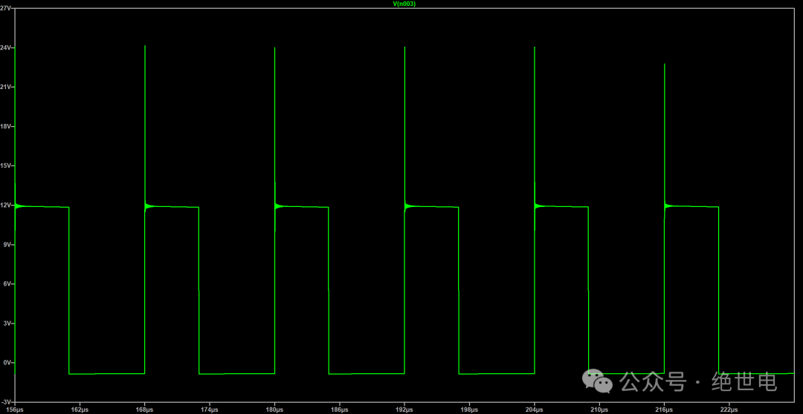
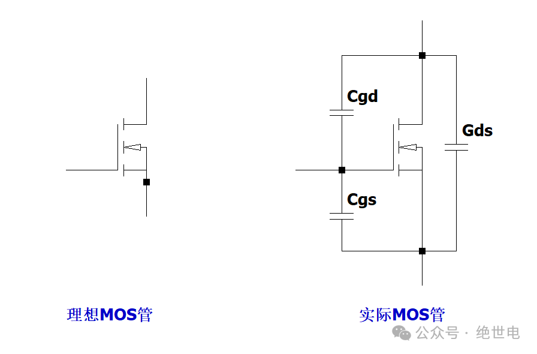
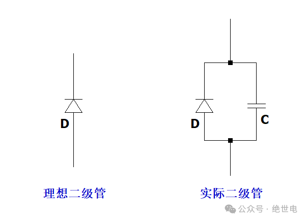
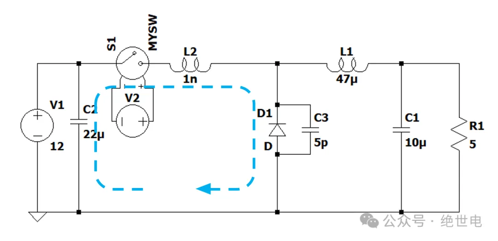
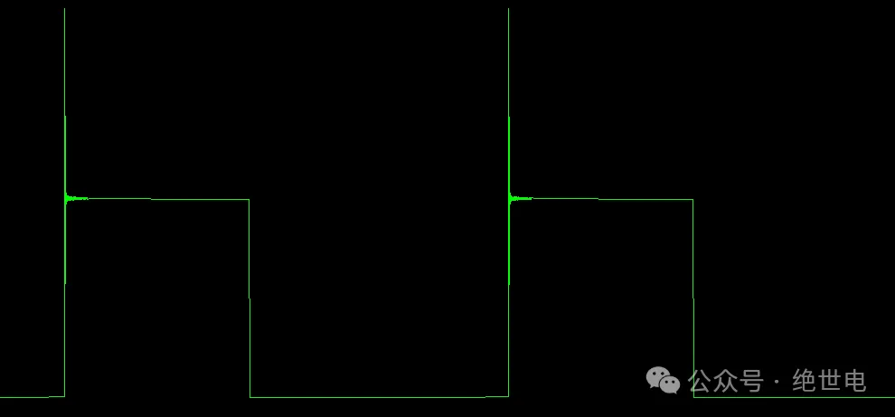
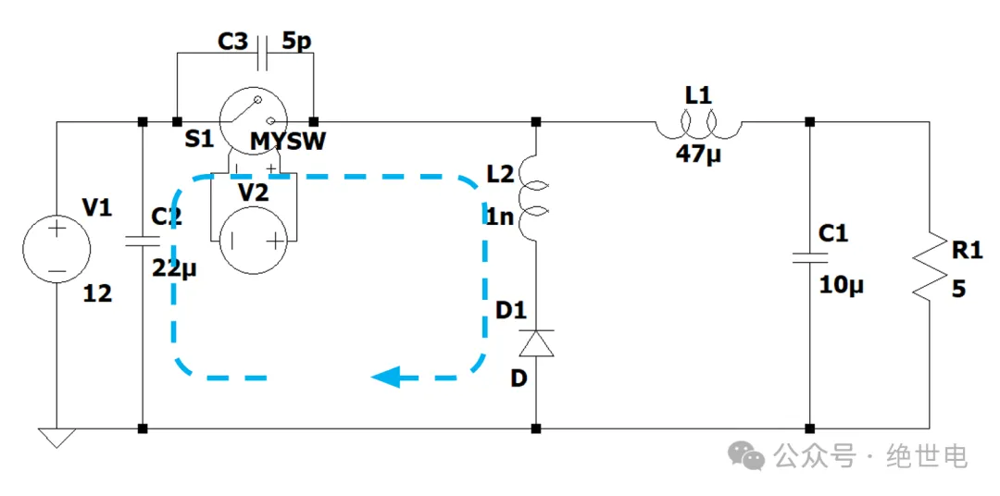
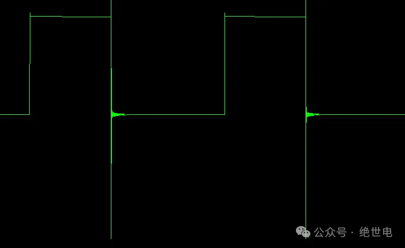
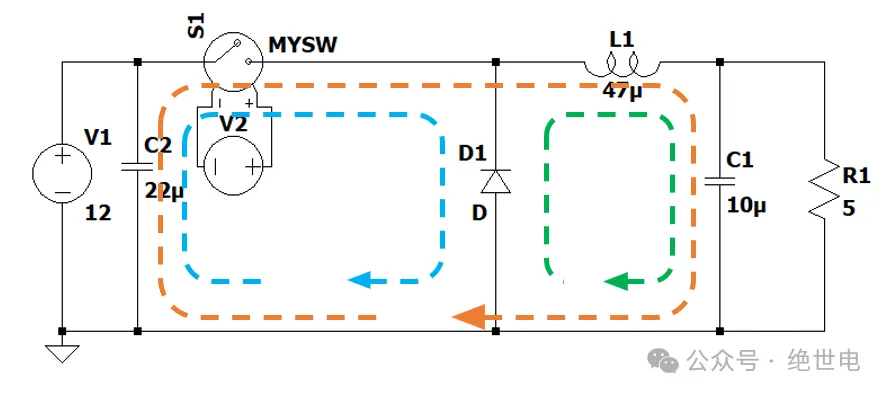
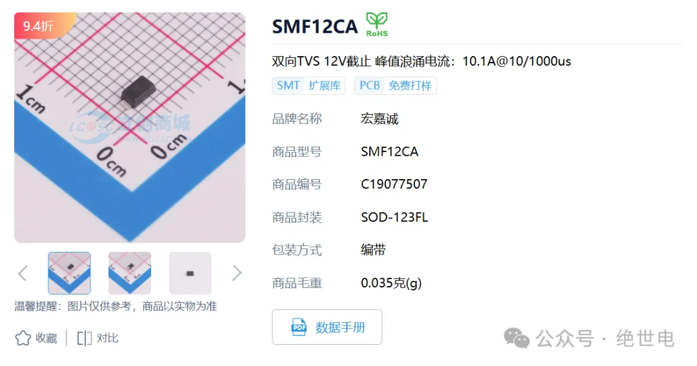

+++
date = '2025-08-23T14:00:00+08:00'
draft = false
title = 'DCDC 开关节点振铃大解密'
author = "绝世电"
tags = ["电源设计", "DCDC", "PCB设计", "模拟电路"]
math = true
+++

## 前言——开关节点振铃

为什么电源板子总炸？新焊好的电源，刚开始一段时间正常，但是用多一会，MOS 管就星火漫天，炸管不断。导致这个现象的部分原因，是这篇文章将要讲解的内容——开关节点振铃。DCDC 中，存在一个电流节点，开关过程中，这个节点存在大电流的电流换向，导致了电压过冲等现象的发生，容易烧坏器件。想要规避这类现象的发生，我们需要了解它的产生原理，发生场景等，再去想方设法地去解决。本文用 LTspice 仿真软件，详细探究振铃背后的秘密。

## 1 开关节点振铃是什么

下图是 BUCK（降压）电路的基本拓补，如红圈所示位置是开关节点。

在 DCDC 工作过程中，开关 S1 由 PWM 控制器控制，一开一关。电路有两种工作状态：

- S1 闭合，电流 I1 流进节点，I2 为 0
- S1 开路，电流 I2 流进节点，I1 为 0

观察下面仿真波形图，理想状态下，I1 和 I2 应只有一条支路有电流，此时开关节点电压也为规整的方波。

但是正常来说，实际上我们制作出来的 DCDC，开关节点电压并不会这么规整，下图所示是振铃的仿真图形。

由上图，能看出，在开关电源的上升沿处出现了一个很高电压的尖峰，放大上升沿部分，可以发现上升沿出现了一个逐步衰减的高频震荡。相较于理想方波，这种现象对器件来说非常不友好，如果不加以控制，可能会导致 MOS 管或者二极管击穿烧毁的现象，影响电源的稳定性。

开关节点的振铃现象可以分为上冲和下冲，如上图所示是上冲现象，下冲现象也将在下文详细分析。

## 2 震荡如何产生

在电路里面，只要是震荡，基本都和 LC 回路有关，实际应用中震荡产生的原因基本都是由于电路布线布局瑕疵而产生的杂散电容电感引起。

如图所示 LC 震荡回路，当在电压源给予 LC 电路高频脉冲时，电路便会引发震荡，震荡的频率取决于 LC 回路的特征频率。

$$f=\frac{1}{2 \pi \sqrt{LC}}$$

DCDC 中，连续快速开关，开关的上升沿和下降沿相当于给整个电路一个高频激励，引发 LC 谐振回路震荡。接下来，要解析震荡产生的原因，只需在 BUCK 电路中找出存在 LC 杂散的回路即可。

## 3 引发震荡的杂散参数

在实际应用中，我们使用 MOS 管或二极管来充当开关的作用。但是这些实际的器件并没有办法做到像真正的开关一样，开就是开，关就是关。在器件的线路中，充斥着很多寄生电容，它们与我们布线产生的寄生电感相互作用，产生震荡。

现在电容找出来了，那电感呢？电感的主要来源其实不是器件本身，主要来源是在实际 PCB 布局布线时引入的。

如上图所示，如果在 PCB 绘制时，不小心将这些环路面积画的过大，就容易引入寄生电感。真空中的电感公式如下图所示。

$$L=\frac{\mu_{0}SN^2}{l}$$

所以经过上面的分析，可以得知，实际应用中的每个元件都不是理想的，或多或少会带有寄生参数。这些参数是引发电路震荡的元凶。

## 4 具体震荡现象分析

### 一、上冲现象

将仿真电路图替换至下图，发现电路发生了上冲现象：

仔细观察发现，相较于理想电路图，该替换电路图多了二极管寄生电容和蓝色环路处的寄生电感。

- 在开关 S1 关闭时，开关节点处于低电平状态，C3 未充电。
- S1 打开瞬间，开关节点电压需突变到 12V，这个过程中，需要给 C3 充电，所以形成了蓝色的充电环路。
- 因为杂散电感的存在，L2 与 C3 共同组成了 LC 震荡回路，导致了瞬间过冲、震荡情况的发生。

### 二、下冲现象

对下图原理图进行仿真，得到仿真波形：

下冲由 S1 开关关断引起。S1 关断，C3 需要充电，通过 L2、D1 回路组成了 LC 震荡回路，原理大致同上。

## 5 如何有效避免开关节点振铃？

### 一、优化布局布线

同一个原理图，不同的布局布线，对电源产生的影响是巨大的。在实际应用中，要考虑该三个环路大小，在 PCB 板中确保散热的情况下，做到尽量紧凑，减小环路面积，可以有效抑制寄生电感，减少振铃现象。

### 二、使用稳压二极管

使用 TVS 管或者稳压二极管，泄放电压尖峰。选用该方法时，泄放电压阈值不应选的太低，假设方波高电平电压 12V，尖峰电压 30V，泄放电压可选取在 20V，不应选择在 12V，否则会导致通过二极管的电流太大，烧毁二极管。

### 三、MOS 缓驱动

通过串联一个小电阻在 MOS 管栅极，可以减缓 MOS 的导通速度，减缓开关节点电压上升或下降时间，给寄生电容充电足够的时间，能有效减小电路振铃。

这个方法的缺陷是，阻值选取过大，会导致开关导通时间过长，增加发热。所以实际值需要根据板子进行调整。

### 四、RC 吸收电路

C4 和 R2 连接开关节点跟地，为高频分量提供了低阻抗、低 Q 值的缓冲电路，使得高频能量在通过吸收电路时被 R2 消耗。具体 RC 值选取规则如下（个人方法，仅供参考）：

1. 在没有 RC 吸收电路的情况下，使用示波器测量振铃频率 f，通过下面公式计算 RC 值。

$$RC=\frac{1}{2\pi f}$$

2. 查询数据手册，估算二极管结电容大小，使吸收电路的 C 值远大于结电容，再计算 R 值。

## 6 总结

电源振铃现象是电源设计里比较常见的一种现象，多是由于 PCB 布局布线引起。振铃可以通过一些方法避免，通过优化布线，增加外置电路等方法可以有效减少振铃现象，提高电源电路稳定性。