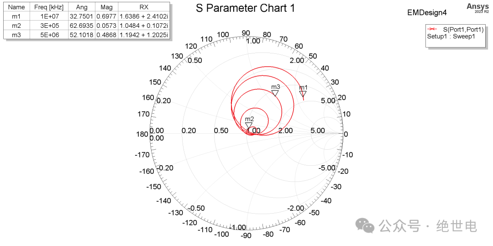
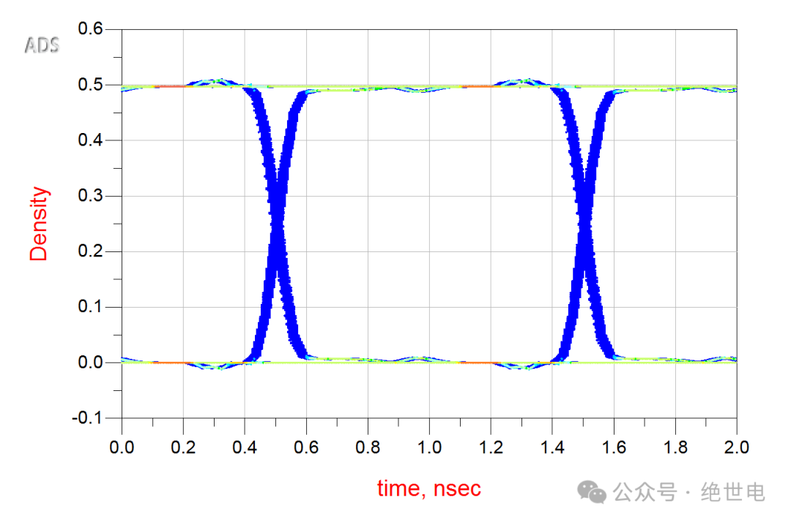
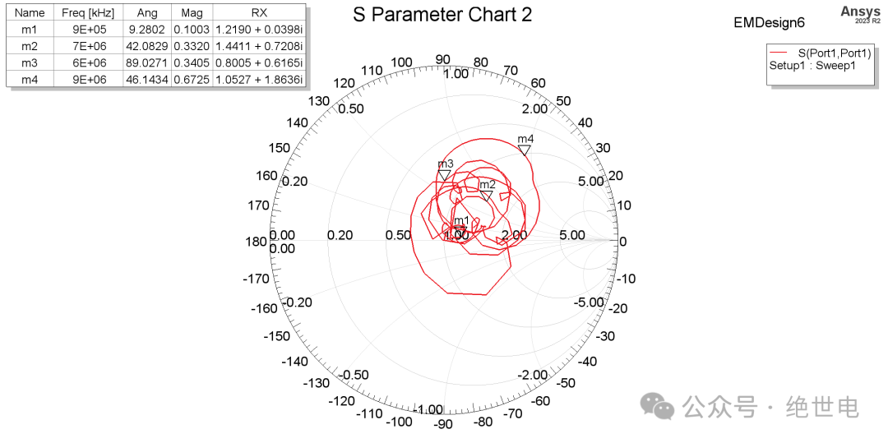

+++
date = '2025-10-08T16:00:00+08:00'
draft = false
title = '高速信号走线打过孔换层，会有多大影响'
author = "绝世电"
tags = ["高速信号", "PCB设计", "模拟电路"]
math = false
+++
## 引言

在一些高速信号板，例如 FPGA、ARM 处理器板，少不了 BGA 封装的走线绘制。这种封装走线又多又杂，在实际应用中经常会用到打过孔换层的走线方法，来在有限的空间中把线走通。但是这种走线会不会对信号产生影响呢？下面我们用 HFSS 和 ADS 仿真软件进行探究。

使用嘉立创阻抗神器计算，可获得的常用的 50Ohm 阻抗四层板叠层结构图，我们先仿照该结构图在 HFSS 中建立类似结构：

测试模型是否建立成功，先建立如图微带线模型，并进行 S 参数仿真测试：

分析 S11 参数，可得微带线归一化阻抗在中心点左右，即在 50ohm 处。

下面来建立类似 BGA 封装条件的传输模型

上图中，类 BGA 的传输模型，在发射与接收端各有两个触点。信号在表层进行传输，通过过孔在地平面进行回流，传输长度约为 3 到 4cm。下面是测得的 S11 参数，可以发现，因为有过孔作用，在高频处 S11 参数并不是稳定的 50Ohm。

将仿真参数导出到 ADS 软件进行时域仿真。仿真使用 500Mhz，1Vpp 的方波信号进行传输，可以看到波形还是很完整的。

下面我们来换一个模型，加入过孔换层操作，进行仿真

可以看到 S11 参数比较杂乱，跟上面比起来差别非常大。

下面仍然使用 ADS 进行时域仿真

可以看到，除了波形抖动幅度略微增大，眼图几乎没有什么变化。这里大胆猜测一下，在短距离传输下，就算是在线路中有过孔这种阻抗不连续的现象，只要及时在附近给电流提供完整的回流路径，对波形几乎没什么影响。

## 总结

在 3 到 4cm 这种长度的布线中，存在过孔换层对信号质量影响不大。在实际应用中只需及时给换层提供回流路径，且回流过孔尽量靠近换层过孔即可。