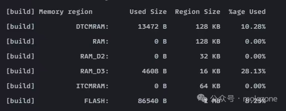

+++
date = '2025-07-29T12:00:00+08:00'
draft = false
title = 'STM32H7 HAL 库开发中的 DMA 传输失败问题的解决方案'
author = "molqzone"
tags = ["STM32", "嵌入式", "CMake"]
+++

## 引言

最近我尝试在 STM32H723ZGT6 上使用 STM32CubeMX + CMake + GCC 方案配置 ADC1 的 DMA Circular Mode，发现在我的 STM32CubeMX 的参数配置正确的情况下仍然配置不成功。现象是可以进入 ADC1 对应的 DMA1_Stream0_IRQHandler 中断函数，但是无法进入 HAL_ADC_ConvCpltCallback。经过排查发现系统稳定地在 DMA 中断中报告传输错误（TEIF - Transfer Error Interrupt Flag）。下面是我的错误验证代码：

```c
void DMA1_Stream0_IRQHandler(void)
{
  /* USER CODE BEGIN DMA1_Stream0_IRQn 0 */
    if (__HAL_DMA_GET_FLAG(&hdma_adc1, DMA_FLAG_TEIF0_4)) {
        log_e("DMA1 Stream0 transfer error occurred"); // 此处报错
    }
  /* USER CODE END DMA1_Stream0_IRQn 0 */
  HAL_DMA_IRQHandler(&hdma_adc1);
  /* USER CODE BEGIN DMA1_Stream0_IRQn 1 */

  /* USER CODE END DMA1_Stream0_IRQn 1 */
}
```

常规的调试手段，如排查 MPU 配置、管理 D-Cache 一致性，乃至验证外设时钟与模拟电源，均无法解决问题。从这个现象可以看出，这个坑并非来自 ADC 或 DMA 外设本身的功能缺陷，而是两者在特定工作模式下，触发了系统级深层次的硬件冲突。幸运的是，最终我在社区的帮助下解决了这一问题。

## 问题根源

这个问题的关键在于 STM32H7 系列并非一个简单的单总线 MCU，而是一个拥有复杂多总线主控和多内存域的 SoC。


由上图可见，STM32H7 被分成三国鼎立的局面，分别是 D1 域、D2 域和 D3 域：

- **D1域**：性能核心。包含 CPU 内核和高速 AXI SRAM（始于0x24000000），是 CPU 存取数据的主战场。
- **D2域**：外设集群。包含 ADC、通用定时器以及 DMA1/DMA2 控制器。
- **D3域**：辅助系统。包含部分低速外设和一块独立的 SRAM（RAM_D3，始于0x38000000）。

一个复杂的多层总线矩阵（Bus Matrix）负责连接所有主控和内存/外设。当一个位于 D2 域的主控（如 DMA1），需要访问 D1 域的从属单元（如 AXI SRAM）时，其访问请求必须经由总线矩阵进行路由和仲裁。

问题的核心即在于此：D1 域的 AXI SRAM 是为 CPU 内核性能最大化而设计的，CPU 对其拥有极高的访问优先权和带宽。当 DMA 控制器作为一个"外部"主控，试图高频地向这块 SRAM 写入数据时，极易与 CPU 的指令操作在总线矩阵层面发生总线竞争，导致无法访问到这部分内存。在这种高负载的跨域访问场景下，硬件仲裁逻辑的复杂性可能导致 DMA 的访问周期被过度延长甚至失败，从而产生总线错误，最终被 DMA 控制器报告为 TEIF。

## 解决方案

常规的 MPU 配置，例如将 AXI SRAM 区域的属性设置为可共享、非缓存，是在策略层面告知系统如何处理该内存。这只能解决访问权限和缓存一致性问题，但无法解决硬件物理拓扑层面固有的总线竞争问题。因此，根治此问题的方案必须从系统架构层面为 DMA 缓冲区重定向内存。

链接器脚本是定义最终可执行文件内存布局的蓝图。它允许开发者精确控制每一个代码段和数据段在物理内存中的位置。默认情况下，所有变量（包括 DMA 缓冲区）都被链接器放置在名为RAM的内存区域，即 D1 域的 AXI SRAM。我们的策略是，将 DMA 缓冲区从高冲突的 D1 域 AXI SRAM，迁移到访问路径更简单、总线竞争更小的 D3 域 RAM_D3。

### 第一步：在链接器脚本中声明专用内存段

STM32CubeMX 会在项目根目录下自动生成一个STM32H723XG_FLASH.ld 文件，且此后生成项目不会再覆盖。我们在文件的 SECTIONS 块中，新增一个输出段定义，将其明确指向RAM_D3物理内存区域。

```linker-script
/* In STM32H723XG_FLASH.ld, inside SECTIONS { ... } */
.ram_d3 (NOLOAD) :
{
  . = ALIGN(4);
  *(.ram_d3)
  *(.ram_d3*)
  . = ALIGN(4);
} >RAM_D3
```

此定义创建了一个名为 .ram_d3 的输出段，并规定它应被放置在 MEMORY 块中定义的 RAM_D3 区域。(NOLOAD) 属性指明该段为非初始化数据，无需在启动时从 Flash 加载（适配 DMA 缓冲区）。

### 第二步：在 C 代码中应用该内存段

随后，在 C 代码中定义 DMA 缓冲区时，我们使用 GCC 的 __attribute__ 指令，告诉编译器将此特定变量放入我们刚刚创建的输入段中。

```c
#define ADC_BUFFER_SIZE 256

// 使用属性指令将此缓冲区变量精确链接到 .ram_d3 段
ALIGN_32BYTES(static uint16_t adc_dma_buffer[ADC_BUFFER_SIZE]) __attribute__((section(".ram_d3")));
```

通过上面两步，我们就成功实现了 DMA 缓冲区的物理内存重定向，规避了总线竞争带来的 TEIF 问题。从前我从来没有修改过甚至没有接触过 .ld 文件，想要用上更强大的主控的代价，也许就是要关注更复杂的细节。

### 补充说明

**2025-11-16 补充：**

事实上，这个问题只有在 STM32CubeMX 生成的 CMake 环境下才会被触发。根本原因在于 STM32CubeMX 生成的默认链接脚本将所有变量分配到了 D1 域的 AXI SRAM 中，这种默认的内存布局配置直接导致了跨域总线访问冲突，从而引发 DMA 传输错误。在其他开发环境或使用不同链接脚本配置的情况下，此问题可能不会出现。

### 验证效果

使用 OpenOCD 烧录程序，可以看到 RAM_D3 区域的内存占用增加了：



## 参考

- [高速缓存 | XRobot Docs](https://docs.xrobot.top/cortex-m/cache.html)
- [【经验分享】STM32H7 DMA 传输异常案例分析 - STM32团队 ST意法半导体中文论坛](https://shequ.stmicroelectronics.cn/thread-633344-1-1.html)