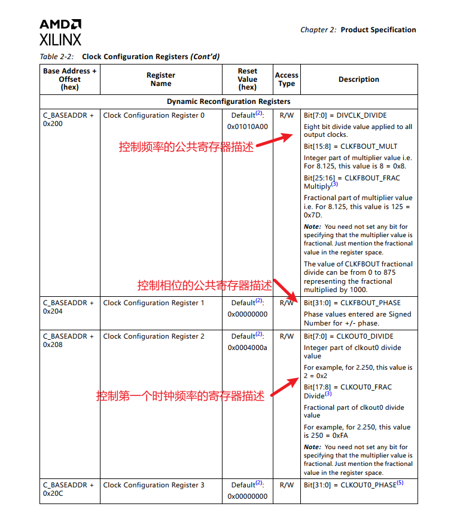
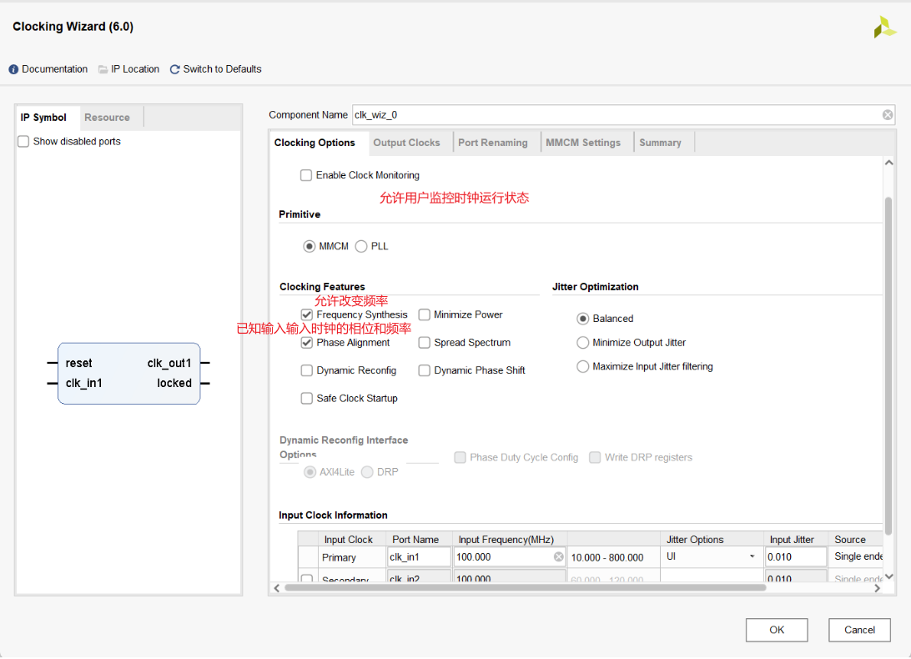
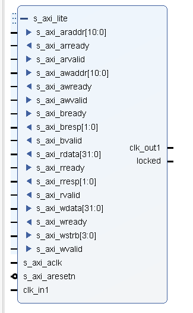
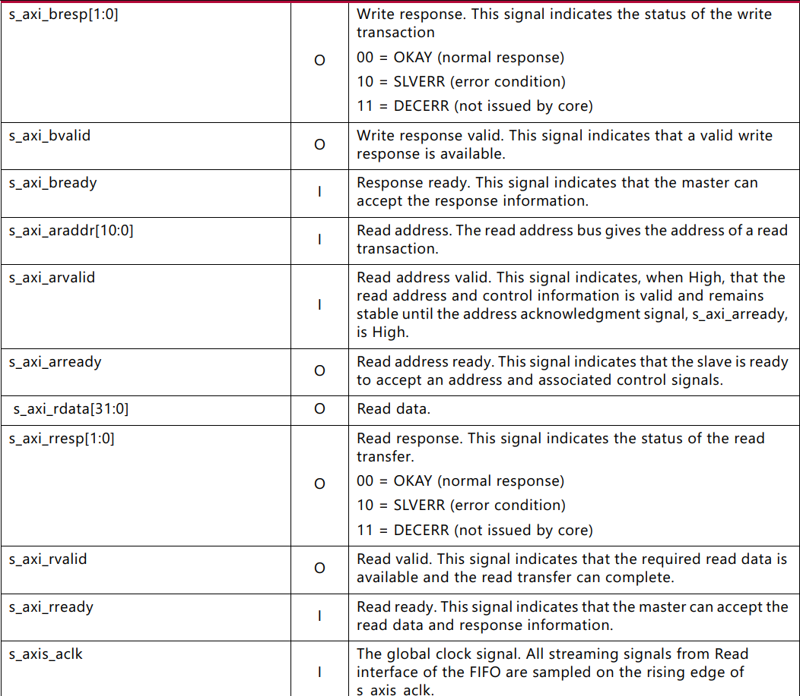

+++
date = '2025-08-07T22:03:45+08:00'
draft = false
title = '利用 Vivado 中的 Clocking Wizard 实现动态调整输出时钟的频率和相位以及相关应用'
author = "阿呆不呆"
tags = ["FPGA 开发", "Vivado", "时钟管理", "AXI4Lite"]
math = false
+++
## 开发背景

**资源连接**：[Clocking Wizard v6.0 手册 pg065-clk-wiz](https://docs.xilinx.com/v/u/en-US/pg065-clk-wiz)

**物理硬件平台**：Xilinx Artix-7 FPGA A704

**开发工具**：VsCode 编译器，Vivado 综合布局，Modelsim 仿真，Verilog 开发语言

博主为了准备电赛，实现其中一个扫频的功能，便利用 Vivado 中现成的 IP 核实现动态调整锁相环输出的频率和相位。过程中发现现有的资料较少遇到不少问题，便以此写一篇文章为记录，也可以供大家参考。有问题的地方劳烦大家指出，也可以进行交流。

## 开发思路

由于我需要从 88MHz-108MHz，并且以 0.1MHz（100K）的频率进行扫频，再阅读手册 15-19 页其相关寄存器，发现 Clocking Wizard 其中有一个公共寄存器控制所有时钟输出频率和相位后，各自时钟还有相关寄存器自行控制。也就是说输入频率，先经过公共的整数+分数倍频（如倍频 8.125），然后经过整数分频后，最后经过每个时钟各自的分频才会输出。

**注意这里特别提到了倍频和分频是整数还是包含分数，分数部分只能为"125"的倍数，倍频只有唯一一次在公共寄存器，普通时钟自身没有倍频只有整数分频，特别的：第一个时钟有分数分频**。

由于我只需要一路时钟输出，所有我选择了第一个时钟。

所有我们为了输出时钟更加的精准，我们需要计算每个频率的相关参数，但是由于硬件描述语言不便于计算相关参数，并且目标频率是有步进的（虽然是一个范围），由此我决定利用 Python 脚本生成相关参数，再作为 COE 文件导入工程，用 ROM 存放直接读取，这样子更加便捷并且时序上更简单。

最后利用 Vivado 现有的 Clocking，用 AXI4Lite 协议（握手协议）来读写其内部寄存器，从而达到改变频率和相位的效果。

**（以下截出了部分的寄存器，其它寄存器描述大差不差，英语不好可以翻译一下。）**



这里的 C_BASEADDR 是基准地址，是内部自己控制的，不需要我们控制，我们只需要控制 0x200 这个公共寄存器，由于相位我们单独控制就不需要控制 0x204 了，另外时钟 0 控制频率的寄存器是 0x208，往下翻发现时钟 1 是 0x214，时钟 2 是 0x220……所以我们在写代码的时候可以以时钟 0 的频率寄存器为准，地址可以是 0x208+时钟号×0x00C（就是按 12 递增），同样的道理，相位寄存器也可以这样写。

写完寄存器后，要记得写重载寄存器 0x25C，Bit[0]位表示要重新加载，Bit[1]在控制重新加载默认（也就是在 Vivado 的 UI 界面配置的初始化状态），还是加载你动态写入的寄存器。加载完成后，也就是 Locked 拉高，内部会重新将 Bit[0]进行复位成 0。


这个是要用的 Clocking 的初始化界面，相信大家经常会用到。



## 具体步骤

### 参数计算

这里是使用 Python 以及输出时钟 1，我的系统输入时钟为 50MHz，所以我算的五个参数分别是：（有点个人口语描述）

- 整数倍频（对所有时钟）
- 分数倍频（对所有时钟）
- 整数分频（对所有时钟）
- 整数分频（对第一个时钟）
- 分数分频（对第一个时钟）

**要注意，这里凡是分数，都得是"125"的倍数，例如 8.125 倍频，4.250 分频。**

#### 脚本一

```python
# -*- coding: utf-8 -*-
import math

def find_best_params(target_freq, clk_in=50.0):
    """
    计算最接近目标频率的倍频和分频参数。
    :param target_freq: 目标频率 (MHz)
    :param clk_in: 输入时钟频率 (MHz)
    :return: (整数倍频, 小数倍频, 一级整数分频, 二级整数分频, 二级小数分频)
    """
    frac_unit = 0.125
    best = None
    min_err = float('inf')
    # 预先生成所有可能的小数部分，避免重复计算
    frac_list = [round(i * frac_unit, 3) for i in range(0, 8)]
    for mult_int in range(1, 50):  # 适当减小上限，加速
        for mult_frac in frac_list:
            mult = mult_int + mult_frac
            for div1 in range(1, 5):
                for div2 in range(1, 15):  # 适当减小上限，加速
                    for div_frac in frac_list:
                        div = div2 + div_frac
                        freq = clk_in * mult / div1 / div
                        err = abs(freq - target_freq)
                        if err < min_err:
                            min_err = err
                            best = (
                                mult_int,
                                mult_frac,
                                div1,
                                div2,
                                div_frac
                            )
                            if min_err < 1e-6:
                                return best  # 直接返回，极大加速
    return best

def format_params(freq, params):
    """
    按指定格式输出参数
    """
    mult_int, mult_frac, div1, div2, div_frac = params
    return f"""{freq}:
frq_mult_int = {mult_int}
frq_mult_float = {mult_frac}
frq_div_int_all = {div1}
frq_div_int = {div2}
frq_div_float = {div_frac}
"""

if __name__ == "__main__":
    # 目标频率列表，可自行修改
    target_freqs = [88, 88.1, 88.2, 88.3, 88.4, 88.5, 88.6, 88.7, 88.8, 88.9, 89,
                        89.1, 89.2, 89.3, 89.4, 89.5, 89.6, 89.7, 89.8, 89.9, 90,
                        90.1, 90.2, 90.3, 90.4, 90.5, 90.6, 90.7, 90.8, 90.9, 91,
                        91.1, 91.2, 91.3, 91.4, 91.5, 91.6, 91.7, 91.8, 91.9, 92,
                        92.1, 92.2, 92.3, 92.4, 92.5, 92.6, 92.7, 92.8, 92.9, 93,
                        93.1, 93.2, 93.3, 93.4, 93.5, 93.6, 93.7, 93.8, 93.9, 94,
                        94.1, 94.2, 94.3, 94.4, 94.5, 94.6, 94.7, 94.8, 94.9, 95,
                        95.1, 95.2, 95.3, 95.4, 95.5, 95.6, 95.7, 95.8, 95.9, 96,
                        96.1, 96.2, 96.3, 96.4, 96.5, 96.6, 96.7, 96.8, 96.9, 97,
                        97.1, 97.2, 97.3, 97.4, 97.5, 97.6, 97.7, 97.8, 97.9, 98,
                        98.1, 98.2, 98.3, 98.4, 98.5, 98.6, 98.7, 98.8, 98.9, 99,
                        99.1, 99.2, 99.3, 99.4, 99.5, 99.6, 99.7, 99.8, 99.9, 100,
                        100.1, 100.2, 100.3, 100.4, 100.5, 100.6, 100.7, 100.8, 100.9, 101,
                        101.1, 101.2, 101.3, 101.4, 101.5, 101.6, 101.7, 101.8, 101.9, 102,
                        102.1, 102.2, 102.3, 102.4, 102.5, 102.6, 102.7, 102.8, 102.9, 103,
                        103.1, 103.2, 103.3, 103.4, 103.5, 103.6, 103.7, 103.8, 103.9, 104,
                        104.1, 104.2, 104.3, 104.4, 104.5, 104.6, 104.7, 104.8, 104.9, 105,
                        105.1, 105.2, 105.3, 105.4, 105.5, 105.6, 105.7, 105.8, 105.9, 106,
                        106.1, 106.2, 106.3, 106.4, 106.5, 106.6, 106.7, 106.8, 106.9, 107,
                        107.1, 107.2, 107.3, 107.4, 107.5, 107.6, 107.7, 107.8, 107.9, 108]
    with open("freq_params.txt", "w", encoding="utf-8") as f:
        for freq in target_freqs:
            params = find_best_params(freq)
            f.write(format_params(freq, params))
```

这个脚本就是生成相关参数，并且将其以如下格式输出到 freq_params.txt 文件里面，经过验证它的精度可以去到小数点后三位，所以已经满足了我比赛的要求，看官也可以自己计算一下（50MHz 作为输入）。接下来，要将他们按照不同参数分到不同的 ROM 里面，就需要就行归类。并且在开头加上 COE 文件的两行，这就要利用脚本二了。

```txt
MEMORY_INITIALIZATION_RADIX=10;
MEMORY_INITIALIZATION_VECTOR=

88.1:
frq_mult_int = 4
frq_mult_float = 0.625
frq_div_int_all = 1
frq_div_int = 2
frq_div_float = 0.625
```

### IP 核配置


这里使用的实现方式是 MMCM，可以说 MMCM 是增强版的 PLL，其对输出时钟的控制灵活性和精度更大。我的输入时钟是单端的 50MHz 系统时钟，输出选择了时钟 1，初始化 88MHz。

- **Frequency Synthesis**：表示可以生成不同频率的时钟
- **Phase Alignment**：已知输入时钟的频率和相位
- **Dynamic Reconfig**：表示可以创新改写寄存器
- **AXI4Lite**：是一种接口协议，其实就是握手信号，也可以选择 DRP 不过相关的寄存器地址就会发生改变，并且文档还是另一个，当时最开始是使用这个协议，一直没效果便改成了 AXI4Lite，其实这个是对 DRP 的再一次封装
- **Phase Duty Cycle Config**：如果要修改相位，得勾上这个



可以看到，配置完后，左边 IP Symbol 界面展示了现有的端口，其中展开可以看到 AXI4Lite 协议的相关端口。其中各个端口的含义可以查看一下手册里面的说明，简单来说其实就是写地址+写数据+写有效位标识以及他们各自的握手信号，写完一次后，还有应答信号以及应答信号的握手信号。

**（特别的读写是分开的）**




### 驱动 Clocking Wizard 模块

可以发现，我们可以将修改寄存器作为一个 module 模块，然后用一个上级模块控制写入的参数和顺序。

#### time_tree_dy.v

这个模块是用来控制读写的，大致的思路是使用二段式的状态机，会先计算总共要写入的次数，然后先写公共寄存器，然后依次写各自时钟的频率寄存器，在依次写各自时钟的相位寄存器，最后写重加载寄存器。

**（我这里预留了俩路信号，是到处验证的时候为了做对比，可以通过端口定义的 clk_control_num 配合 Vivado 的 UI 界面勾选时钟的数量，保证整个代码的通用性）**

不过，为了代码写的方便，所以这里我的端口有点多，显得有点唐，不过在上级控制模块会有 5 个 ROM 读取上述的五个参数，可以直接传递给对应端口，所以怎么方便怎么来吧。

另外一些特别的地方我都有注释。

```verilog
/*==============================================
* Function Name  : time_tree_dy.v
* Description    : 该模块是为了动态设计时钟树，
*                  主要听从于STM32F4的需求，
*                  通过动态配置实现不同频率的时钟输出
* input port     : 详细接口见下方注释
* output port    : 详细接口见下方注释
* Author         : ADBD
*==============================================*/
module time_tree_dy(
    input  wire         sys_clk,        // 系统时钟
    input  wire         rst_n,          // 低电平复位

    input  wire         enable,         // 模块启动信号
    input  wire         valid,          // 输入有效信号
    output reg          ready,          // 输出就绪信号，表示模块已准备好接收数据

    input  wire [2:0]    clk_control_num,// 需要控制的时钟总数量
    input  wire [2:0]    clk_choise,     // 时钟选择信号，0表示全部时钟，
                                          // 1表示时钟1，2表示时钟2，3表示时钟3
    input  wire          phase_enable,   // 相位使能信号，1-使能相位配置，0-不使能相位配置
    input  wire [7:0]    frq_mult_int,   // 频率倍频系数，正数部分，对于全部时钟
    input  wire [9:0]    frq_mult_float, // 频率倍频系数，小数部分，对于全部时钟
    input  wire [7:0]    frq_div_int,    // 频率分频系数,整数部分，复用，可对所有时钟，也可以对某个时钟
    input  wire [9:0]    frq_div_float,  // 频率分频系数,小数部分，对于时钟1才有小数分频
    input  wire [31:0]   frq_phase_value,// 频率相位值，对各自的时钟进行设置
    output wire          accomplish,     // 表示写寄存器全部完成

    output wire          error_sign,     // 错误信号
    output wire          clk_out1,       // 输出时钟1
    output wire          locked          // 锁定信号
);

    // 状态机定义和逻辑实现...
    // 详细代码实现见原文

    clk_module clk_module_inst (
        .s_axi_aclk(sys_clk),
        .s_axi_aresetn(rst_n),
        .s_axi_awaddr(s_axi_awaddr),
        .s_axi_awvalid(s_axi_awvalid),
        .s_axi_awready(s_axi_awready),
        .s_axi_wdata(s_axi_wdata),
        .s_axi_wstrb(s_axi_wstrb),
        .s_axi_wvalid(s_axi_wvalid),
        .s_axi_wready(s_axi_wready),
        .s_axi_bresp(s_axi_bresp),
        .s_axi_bvalid(s_axi_bvalid),
        .s_axi_bready(s_axi_bready),
        .clk_out1(clk_out1),
        .locked(locked),
        .clk_in1(sys_clk)
    );
endmodule
```

#### MMCM_Control.v

这个模块控制通过握手信号进行参数的传输，和 ROM 的按顺序读取。也是用状态机写的。

```verilog
module MMCM_Control(
    input wire      sys_clk,
    input wire      rst_n,
    output wire     clk_out1,
    output reg [7:0] frq,
    input  wire      frq_search_over,
    input  wire      clc_accompish,
    output wire      locked
);

    localparam  IDLE        = 0,
                START       = 1,
                WRITE       = 2,
                WAIT        = 3,
                Once_OVER   = 4,
                OVER        = 5;

    wire ready;
    wire accomplish;

    // ROM 实例化和控制逻辑
    frq_mult_int_rom frq_mult_int_rom_inst(
        .addra(addra),
        .clka(sys_clk),
        .douta(frq_mult_int_all)
    );

    // 其他 ROM 实例化...

    time_tree_dy time_tree_dy_inst (
        .sys_clk(sys_clk),
        .rst_n(rst_n),
        .enable(1'b1),
        .valid(valid),
        .ready(ready),
        .clk_control_num(3'b1),
        .clk_choise(clk_choise),
        .phase_enable(1'b0),
        .frq_mult_int(frq_mult_int_all),
        .frq_mult_float(frq_mult_float_all),
        .frq_div_int(frq_div_int_w),
        .frq_div_float(frq_div_float),
        .frq_phase_value(32'd0),
        .accomplish(accomplish),
        .error_sign(error_sign),
        .clk_out1(clk_out1),
        .locked(locked)
    );
endmodule
```

### 验证

用 Vivado+Modelsim 联合仿真。

**这里要注意，要等待 IP 核的 locked 信号拉高后，也就是信号稳定后，才能进行后续。**


这个是写入 IP 核的端口时序。


这个是写一次后，locked 信号拉高后，输出信号周期为 11351ps，计算得为 88.097MHz 接近 88.1MHz。
